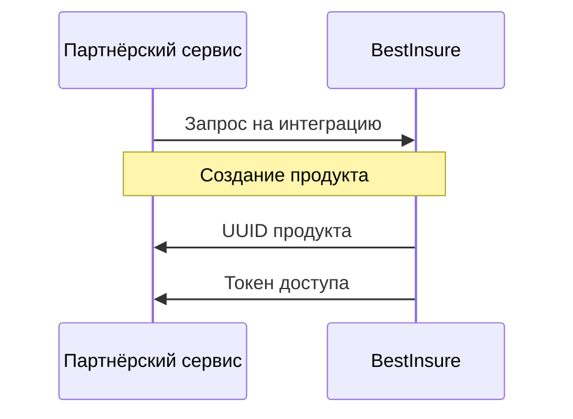

# API оформления полиса ВЗР

API предоставляет возможность оформления созданного продукта ВЗР

## Термины и определения

| Термин      | Определение                                                                           |
|-------------|---------------------------------------------------------------------------------------|
| **Заказ**   | Сущность, отражающая процесс оформления продукта                                      |
| **Продукт** | Неделимый набор услуг и условий обслуживания                                          |
| **PS**      | Партнёрский сервис                                                                    |
| **BI**      | BestInsure                                                                            |
| **ИС**      | Информационная Система BestInsure                                                     |
| **Прим**    | Примечание, у каждого запроса свой список примечаний, увидеть можно под телом запроса |

## Интеграция

Для использования партнёрского API необходимо зафиксировать все условия обслуживания в Продукте.
Также, необходимо запросить токен авторизации.



После этого можно управлять заявками на обслуживание по этому продукту.

## API для работы с Заказами

### Общие положения

**Production**: https://...

Обмен данными с **BI** осуществляется по REST API.

Для авторизации используется схема **Token-Based Authentication**.

Токен предоставляется **PS** в рамках интеграции с **BI** и передаётся в HTTP-заголовке `Authorization` с ключевым
словом `Bearer`:

```text
Authorization: Bearer <token>
```

### GET /api/traveling_abroad/

**Получение списка продуктов для оформления заказа**

**Параметры запроса**

**Параметры запроса**

* `client_id` - id партнера для фильтрации
* `is_available` - фильтрация по статусу черновика, false - черновик, true обычный продукт
* `is_active` - фильтрация по статусу продукта, false - заблокированный продукт, true - активный

**Дополнительные сведения**

Используя этот метод можно получить список продуктов для витрины. Для перехода к этапу оформления отправляем запрос "
Создание заказа" (см. ниже) передавая в него id продукта в качестве параметра traveling_abroad.

**Пример запроса**

```shell
curl --location \
--request GET 'https://b2b.bestinsure.tech/api/traveling_abroad/?client_id=36&is_available=true&is_active=true' \
--header 'Authorization: Bearer <token>' \
--header 'Content-Type: application/json'
```

**Пример ответа**

```json
[
  {
    "id": 81,
    "is_active": true,
    "created_at": "1667995270",
    "modified_at": "1667995304",
    "is_available": true,
    "medicine_included": false,
    "template": false,
    "name": "Тестовый ВЗР (без медицинского страхования)",
    "description": "Медицинское страхование отключено",
    "comment": null,
    "one_time_tariff": 81,
    "multiple_tariff": 81,
    "age_coefficient": 81,
    "territorial_coefficient": 81,
    "target_coefficient": 81,
    "sports_coefficient": 81,
    "alien_coefficient": 81,
    "quantitative_coefficient": 81,
    "discount_coefficient": 81,
    "accident": 81,
    "baggage": 81,
    "sports_equipment": 81,
    "cancellations": 81,
    "cancellations_d": 81,
    "unforeseen_expenses": 81,
    "failure": 81,
    "flight_delay": 81,
    "docking": 81,
    "civil_blame": 81,
    "client": 36
  },
  {
    "id": 82,
    "is_active": true,
    "created_at": "1668157513",
    "modified_at": "1668157529",
    "is_available": true,
    "medicine_included": true,
    "template": false,
    "name": "TEST",
    "description": null,
    "comment": null,
    "one_time_tariff": 82,
    "multiple_tariff": 82,
    "age_coefficient": 82,
    "territorial_coefficient": 82,
    "target_coefficient": 82,
    "sports_coefficient": 82,
    "alien_coefficient": 82,
    "quantitative_coefficient": 82,
    "discount_coefficient": 82,
    "accident": 82,
    "baggage": 82,
    "sports_equipment": 82,
    "cancellations": 82,
    "cancellations_d": 82,
    "unforeseen_expenses": 82,
    "failure": 82,
    "flight_delay": 82,
    "docking": 82,
    "civil_blame": 82,
    "client": 36
  },
  {
    "id": 4,
    "is_active": true,
    "created_at": "1666770580",
    "modified_at": "1667992659",
    "is_available": true,
    "medicine_included": true,
    "template": false,
    "name": "Тестовый ВЗР",
    "description": "Описание тестового МСП",
    "comment": "Тестовый комментарий к тестовому ВЗР",
    "one_time_tariff": 4,
    "multiple_tariff": 4,
    "age_coefficient": 4,
    "territorial_coefficient": 4,
    "target_coefficient": 4,
    "sports_coefficient": 4,
    "alien_coefficient": 4,
    "quantitative_coefficient": 4,
    "discount_coefficient": 4,
    "accident": 4,
    "baggage": 4,
    "sports_equipment": 4,
    "cancellations": 4,
    "cancellations_d": 4,
    "unforeseen_expenses": 4,
    "failure": 4,
    "flight_delay": 4,
    "docking": 4,
    "civil_blame": 4,
    "client": 36
  }
]
```

### GET /api/traveling_abroad/{id}/

**Получение информации по продукту**

**Параметры запроса**

* `id` - id продукта

**Дополнительные сведения**

Из этого запроса получаются необходимые данные для заполнения оформления. Список значений, которые можно получить:

1. Страховая программа и страховая сумма для дополнительных видов страхования (НС, Багаж, Спортивные инвентарь и т. д.)
2. Период действия полиса и кол-во дней страховой защиты для типа поездки "Многократная"
3. Цели поездки, дополнительные цели, виды спорта, является ли цель поездки видом спорта (наличие данных в массиве
   additional_target_type)

**Пример запроса**

```shell
curl --location \
--request GET 'https://b2b.bestinsure.tech/api/traveling_abroad/4/' \
--header 'Authorization: Bearer <token>' \
--header 'Content-Type: application/json'
```

**Пример ответа**

Формат ответа json. Содержит в себе всю информацию по оформляемому ВЗР-продукту. В целях сохранения читаемого вида
документации пример json-а не добавлен.

### POST /api/traveling_abroad_certificate/

**Создание заказа**

#### Алгоритм создания заказа

1. Отправить запрос на создание заказа.
    * Таймаут ответа на запрос: **5 секунд**.
    * По достижении таймаута возвращается информация о состоянии заказа - п.2.
2. Проверить статус:
    * Если **ready**, то заказ создан и успешно обработан.
    * Если **created**, то заказ создан и находится в очереди на обработку, перейти к шагу 3.
    * Если статус **processing**, то повторить шаг 3.
    * Если статус **validation_error**, то параметры заявки невалидны.
    * Если статус **processing_error** или получены коды ответа **420/500**, то необходимо направить запрос в тех.
      поддержку.
3. Отправить запрос на получение информации по заказу.
    * Перейти к п.2.

**Тело запроса**

| Поле             | Тип данных | Описание               | Обязательный | Значение при отправке |
|------------------|------------|------------------------|--------------|-----------------------|
| is_available     | boolean    | статус черновика       | Да           | false                 |
| traveling_abroad | number     | идентификатор продукта | Да           |                       |

**Дополнительные сведения**

Когда ответ от запроса получен, можно сделать редирект на страницу оформления передавая id заказа и id продукта в
качестве URL параметров. После чего можно отправить запросы "Получение информации по заказу", для дальнейшего заполнения
данных заказа и получения необходимых сведений для заполнения.

**Коды ответов**

| Код | Описание                                                                 |
|-----|--------------------------------------------------------------------------|
| 201 | Заявка создана и сохранена.                                              |
| 400 | Ошибка валидации тела запроса. Проверьте корректность параметров заявки. |
| 401 | Ошибка авторизации. Проверьте корректность указанного токена.            |
| 420 | Ошибка бизнес-логики. Обратитесь в службу технической поддержки.         |
| 5XX | Внутренняя ошибка. Обратитесь в службу технической поддержки.            |

**Пример запроса**

```shell
curl --location --request POST 'https://b2b.bestinsure.tech/api/traveling_abroad_certificate/' \
--header 'Authorization: Bearer <token>' \
--header 'Content-Type: application/json' \
--data-raw '{
  "is_available": "false",
  "traveling_abroad": "Идентификатор продукта",
}'
```

**Пример ответа**

```json
{
  "data": {
    "amount_multiple_tariff": null,
    "amount_one_time_tariff": null,
    "available_currencies": [],
    "country": [],
    "traveling_type": "Однократная",
    "currency_type": null,
    "date_from": null,
    "date_to": null,
    "period": 0,
    "days_count": 0,
    "birth_date": null,
    "eng_first_name": null,
    "eng_last_name": null,
    "first_name": null,
    "last_name": null,
    "middle_name": null,
    "passport_series": null,
    "passport_number": null,
    "policyholderIsInsuranced": false,
    "type": null,
    "legal_entity": {
      "id": 89,
      "is_active": false,
      "is_available": true,
      "created_at": "1668434087",
      "modified_at": "1668434087",
      "organizational_legal_form": null,
      "full_organization_name": null,
      "addres": null,
      "phone_number": null,
      "additional_phone_number": null,
      "taxpayer_id": null,
      "economic_activity_type": null,
      "state_registration_number": null
    },
    "physical_entity": {
      "id": 89,
      "total_price": 0,
      "is_active": false,
      "is_available": true,
      "created_at": "1668434087",
      "modified_at": "1668434087",
      "last_name": null,
      "first_name": null,
      "middle_name": null,
      "last_name_en": null,
      "first_name_en": null,
      "birth_date": null,
      "passport_series": null,
      "passport_number": null,
      "is_insured": false,
      "medical_award": "0.00",
      "insurance_award": "0.00",
      "sports_equipment_award": "0.00",
      "accident_award": "0.00",
      "baggage_award": "0.00",
      "cancellations_award": "0.00",
      "cancellations_d_award": "0.00",
      "unforeseen_expenses_award": "0.00",
      "civil_blame_award": "0.00",
      "docking_award": "0.00",
      "failure_award": "0.00",
      "flight_delay_award": "0.00"
    },
    "start_alien": false,
    "target": [
      {
        "id": 100,
        "is_active": true,
        "is_available": true,
        "created_at": "1668434086",
        "modified_at": "1668434086",
        "competition": false,
        "target": null,
        "additional_target": null,
        "additional_target_type": null,
        "certificate": 89
      }
    ],
    "id": 89,
    "insurance_award": 0,
    "total_price": 0,
    ...
    "insured": [],
    "user": {
      "id": 1,
      "login": "zbsadmin@bestdoctor.ru",
      "is_active": true,
      "created_at": "1665567352",
      "first_name": null,
      "last_name": null,
      "middle_name": null,
      "group": "Руководитель BestDoctor",
      "client_id": null,
      "department": null
    },
    "certificate_name": "22-Rules-Type-Code-00000012",
    "product_name": "Тестовый ВЗР",
    "is_active": true,
    "is_available": false,
    "created_at": "1668434087",
    "modified_at": "1668434094",
    "usd_rate": "60.39820",
    "eur_rate": "62.15540",
    "is_template": false,
    "status": false,
    "insuring_type": "Физлицо",
    "accept_date": null,
    "traveling_abroad_rule": "Rules",
    "traveling_abroad_type": "Type",
    "traveling_abroad_code": "Code",
    "insurance_id": 12,
    "clients_comment": null,
    "medicine_franchise": 0,
    "medical_award": "0.00",
    "traveling_abroad": 4,
    "multiple_tariff": null,
    "one_time_tariff": null,
    "tariff_available": [
      {
        "id": 17,
        "name": "Программа А"
      },
      {
        "id": 18,
        "name": "Программа В"
      },
      {
        "id": 19,
        "name": "Программа В1"
      },
      {
        "id": 20,
        "name": "Программа В2"
      }
    ],
    "amount_available": []
  }
}
```

**Список статусов заказа**

* `created` - Заявка создана и сохранена, параметры валидны относительно схемы
* `validation` - Валидация заявки
* `validation_error` - Ошибка валидации заявки
* `processing` - Заявка в обработке
* `processing_error` - Ошибка обработки заявки
* `ready` - Заявка обработана

### GET /api/traveling_abroad_certificate/{id}/

**Получение информации по заказу**

**Параметры запроса**

* `id` - id созданного заказа

**Коды ответов**

| Код | Описание                                                                 |
|-----|--------------------------------------------------------------------------|
| 200 | Актуальный статус заказа.                                                |
| 400 | Ошибка валидации тела запроса. Проверьте корректность параметров заявки. |
| 401 | Ошибка авторизации. Проверьте корректность указанного токена.            |
| 420 | Ошибка бизнес-логики. Обратитесь в службу технической поддержки.         |
| 5XX | Внутренняя ошибка. Обратитесь в службу технической поддержки.            |

**Пример запроса**

```shell
curl --location \
--request GET 'https://b2b.bestinsure.tech/api/traveling_abroad_certificate/89/' \
--header 'Authorization: Bearer <token>' \
--header 'Content-Type: application/json'
```

**Пример ответа**

```json
{
  "data": {
    "amount_multiple_tariff": null,
    "amount_one_time_tariff": null,
    "available_currencies": [],
    "country": [],
    "traveling_type": "Однократная",
    "currency_type": null,
    "date_from": null,
    "date_to": null,
    "period": 0,
    "days_count": 0,
    "birth_date": null,
    "eng_first_name": null,
    "eng_last_name": null,
    "first_name": null,
    "last_name": null,
    "middle_name": null,
    "passport_series": null,
    "passport_number": null,
    "policyholderIsInsuranced": false,
    "type": null,
    "legal_entity": {
      "id": 89,
      "is_active": false,
      "is_available": true,
      "created_at": "1668434087",
      "modified_at": "1668434087",
      "organizational_legal_form": null,
      "full_organization_name": null,
      "addres": null,
      "phone_number": null,
      "additional_phone_number": null,
      "taxpayer_id": null,
      "economic_activity_type": null,
      "state_registration_number": null
    },
    "physical_entity": {
      "id": 89,
      "total_price": 0,
      "is_active": false,
      "is_available": true,
      "created_at": "1668434087",
      "modified_at": "1668434087",
      "last_name": null,
      "first_name": null,
      "middle_name": null,
      "last_name_en": null,
      "first_name_en": null,
      "birth_date": null,
      "passport_series": null,
      "passport_number": null,
      "is_insured": false,
      "medical_award": "0.00",
      "insurance_award": "0.00",
      "sports_equipment_award": "0.00",
      "accident_award": "0.00",
      "baggage_award": "0.00",
      "cancellations_award": "0.00",
      "cancellations_d_award": "0.00",
      "unforeseen_expenses_award": "0.00",
      "civil_blame_award": "0.00",
      "docking_award": "0.00",
      "failure_award": "0.00",
      "flight_delay_award": "0.00"
    },
    "start_alien": false,
    "target": [
      {
        "id": 100,
        "is_active": true,
        "is_available": true,
        "created_at": "1668434086",
        "modified_at": "1668434086",
        "competition": false,
        "target": null,
        "additional_target": null,
        "additional_target_type": null,
        "certificate": 89
      }
    ],
    "id": 89,
    "insurance_award": 0,
    "total_price": 0,
    ...
    "insured": [],
    "user": {
      "id": 1,
      "login": "zbsadmin@bestdoctor.ru",
      "is_active": true,
      "created_at": "1665567352",
      "first_name": null,
      "last_name": null,
      "middle_name": null,
      "group": "Руководитель BestDoctor",
      "client_id": null,
      "department": null
    },
    "certificate_name": "22-Rules-Type-Code-00000012",
    "product_name": "Тестовый ВЗР",
    "is_active": true,
    "is_available": false,
    "created_at": "1668434087",
    "modified_at": "1668434094",
    "usd_rate": "60.39820",
    "eur_rate": "62.15540",
    "is_template": false,
    "status": false,
    "insuring_type": "Физлицо",
    "accept_date": null,
    "traveling_abroad_rule": "Rules",
    "traveling_abroad_type": "Type",
    "traveling_abroad_code": "Code",
    "insurance_id": 12,
    "clients_comment": null,
    "medicine_franchise": 0,
    "medical_award": "0.00",
    "traveling_abroad": 4,
    "multiple_tariff": null,
    "one_time_tariff": null,
    "tariff_available": [
      {
        "id": 17,
        "name": "Программа А"
      },
      {
        "id": 18,
        "name": "Программа В"
      },
      {
        "id": 19,
        "name": "Программа В1"
      },
      {
        "id": 20,
        "name": "Программа В2"
      }
    ],
    "amount_available": []
  }
}
```

### PATCH /api/traveling_abroad_certificate/{id}/

**Заполнение основной информации по заказу**

**Тело запроса**

| Поле                   | Тип данных     | Описание                             | Обязательный     |
|------------------------|----------------|--------------------------------------|------------------|
| amount_multiple_tariff | number         | страховая сумма                      | Да/Нет (прим. 1) |
| amount_one_time_tariff | number         | страховая сумма                      | Нет/Да (прим. 1) |
| country                | array(numbers) | список идентификаторов стран         | Да               |
| currency_type          | string         | валюта заказа                        | Да               |
| date_from              | string         | дата начала действия договора        | Да               |
| date_to                | string         | дата окончания действия договора     | Да               |
| days_count             | number         | кол-во дней страховой защиты         | Да/Нет (прим. 1) |
| insuring_type          | string         | тип страхователя                     | Да               |
| medicine_franchise     | number         | франшиза                             | Да (прим.2)      |
| multiple_tariff        | number         | идентификатор программы              | Да/Нет (прим. 1) |
| one_time_tariff        | number         | идентификатор программы              | Нет/Да (прим. 1) |
| period                 | number         | период действия полиса               | Да/Нет (прим. 1) |
| start_alien            | boolean        | начало поездки с терр. ин-го. гос-ва | Нет              |
| traveling_type         | string         | тип поездки                          | Да               |
| clients_comment        | string         | комментарий                          | Нет              |

**Параметры валидации**

* `date_to` - Дата окончания должна быть больше даты начала (date_from).
* `countries` - Выбираются из списка доступных стран (available_countries), который приходит в ответе PATCH запроса
* `currency_type` - Выбирается из списка доступных валют (available_currencies), который приходит в ответе PATCH запроса
* `one_time_tariff/multiple_tariff` - Выбирается из списка доступных программ (tariff_available), который приходит в
  ответе PATCH запроса
* `amount_one_time_tariff/amount_multiple_tariff` - Выбирается из списка доступных страховых сумм (amount_available),
  который приходит в ответе PATCH запроса

**Примечания**

1. В зависимости от выбранного типа поездки. Многократная - первый вариант, однократная - второй вариант
2. Минимальное возможное значение 0 (по умолчанию), можно не изменять

**Дополнительные условия**

Заполнение некоторых пунктов происходит поэтапно, так как значения для определенных полей ввода подгружаются в
зависимости от выбора предыдущих. Шаги заполнения для зависимых полей:

1. Страна
2. Валюта

Тип поездки "Однократная":

3. Программа страхования
4. Страховая сумма

Тип поездки "Многократная":

3. Период действия полиса
4. Кол-во дней страховой защиты
5. Программа страхования
6. Страховая сумма

Данные для заполнения периода действия и кол-ва дней страховой защиты могут быть получены из таблицы ТБ многократный (по
ключу multiple_tariff), которая вложена в объект продукта получаемый посредством отправки запроса "Получение информации
по продукту". - [GET /api/traveling_abroad/{id}/](#get-apitraveling_abroadid)

**Пример запроса**

```shell
curl --location \
--request PATCH 'https://b2b.bestinsure.tech/api/traveling_abroad_certificate/89/' \
--header 'Authorization: Bearer <token>' \
--header 'Content-Type: application/json' \
--data-raw '{
  "amount_multiple_tariff": null,
  "amount_one_time_tariff": 201,
  "country": [
    11
  ],
  "currency_type": "€",
  "date_from": "2022-12-31",
  "date_to": "2023-02-28",
  "days_count": 30,
  "insuring_type": "Физлицо",
  "multiple_tariff": null,
  "one_time_tariff": 20,
  "period": 365,
  "start_alien": false,
  "traveling_type": "Однократная",
  "medicine_franchise": 0
}'

```

**Пример ответа**

```json
{
  "data": {
    "amount_multiple_tariff": null,
    "amount_one_time_tariff": null,
    "available_currencies": [],
    "country": [],
    "traveling_type": "Однократная",
    "currency_type": null,
    "date_from": null,
    "date_to": null,
    "period": 0,
    "days_count": 0,
    "birth_date": null,
    "eng_first_name": null,
    "eng_last_name": null,
    "first_name": null,
    "last_name": null,
    "middle_name": null,
    "passport_series": null,
    "passport_number": null,
    "policyholderIsInsuranced": false,
    "type": null,
    "legal_entity": {
      "id": 89,
      "is_active": false,
      "is_available": true,
      "created_at": "1668434087",
      "modified_at": "1668434087",
      "organizational_legal_form": null,
      "full_organization_name": null,
      "addres": null,
      "phone_number": null,
      "additional_phone_number": null,
      "taxpayer_id": null,
      "economic_activity_type": null,
      "state_registration_number": null
    },
    "physical_entity": {
      "id": 89,
      "total_price": 0,
      "is_active": false,
      "is_available": true,
      "created_at": "1668434087",
      "modified_at": "1668434087",
      "last_name": null,
      "first_name": null,
      "middle_name": null,
      "last_name_en": null,
      "first_name_en": null,
      "birth_date": null,
      "passport_series": null,
      "passport_number": null,
      "is_insured": false,
      "medical_award": "0.00",
      "insurance_award": "0.00",
      "sports_equipment_award": "0.00",
      "accident_award": "0.00",
      "baggage_award": "0.00",
      "cancellations_award": "0.00",
      "cancellations_d_award": "0.00",
      "unforeseen_expenses_award": "0.00",
      "civil_blame_award": "0.00",
      "docking_award": "0.00",
      "failure_award": "0.00",
      "flight_delay_award": "0.00"
    },
    "start_alien": false,
    "target": [
      {
        "id": 100,
        "is_active": true,
        "is_available": true,
        "created_at": "1668434086",
        "modified_at": "1668434086",
        "competition": false,
        "target": null,
        "additional_target": null,
        "additional_target_type": null,
        "certificate": 89
      }
    ],
    "id": 89,
    "insurance_award": 0,
    "total_price": 0,
    ...
    "insured": [],
    "user": {
      "id": 1,
      "login": "zbsadmin@bestdoctor.ru",
      "is_active": true,
      "created_at": "1665567352",
      "first_name": null,
      "last_name": null,
      "middle_name": null,
      "group": "Руководитель BestDoctor",
      "client_id": null,
      "department": null
    },
    "certificate_name": "22-Rules-Type-Code-00000012",
    "product_name": "Тестовый ВЗР",
    "is_active": true,
    "is_available": false,
    "created_at": "1668434087",
    "modified_at": "1668434094",
    "usd_rate": "60.39820",
    "eur_rate": "62.15540",
    "is_template": false,
    "status": false,
    "insuring_type": "Физлицо",
    "accept_date": null,
    "traveling_abroad_rule": "Rules",
    "traveling_abroad_type": "Type",
    "traveling_abroad_code": "Code",
    "insurance_id": 12,
    "clients_comment": null,
    "medicine_franchise": 0,
    "medical_award": "0.00",
    "traveling_abroad": 4,
    "multiple_tariff": null,
    "one_time_tariff": null,
    "tariff_available": [
      {
        "id": 17,
        "name": "Программа А"
      },
      {
        "id": 18,
        "name": "Программа В"
      },
      {
        "id": 19,
        "name": "Программа В1"
      },
      {
        "id": 20,
        "name": "Программа В2"
      }
    ],
    "amount_available": []
  }
}
```

### DELETE /api/traveling_abroad_certificate/{id}/

**Удаление заказа**

**Параметры запроса**

* `id` - id заказа

**Пример запроса**

```shell
curl --location \
--request DELETE 'https://b2b.bestinsure.tech/api/traveling_abroad_certificate/65/' \
--header 'Authorization: Bearer <token>' \
--header 'Content-Type: application/json' \
```

### POST /api/traveling_abroad_certificate_target/

**Создание цели поездки**

**Тело запроса**

| Поле                   | Тип данных    | Описание                | Обязательный |
|------------------------|---------------|-------------------------|--------------|
| additional_target      | number        | вид деятельности        | Да (прим. 1) |
| additional_target_type | number        | страховая сумма         | Да (прим. 1) |
| certificate            | string/number | идентификатор заказа    | Да           |
| competition            | boolean       | участие в соревнованиях | Нет          |
| target                 | number        | идентификатор цели      | Да           |

**Примечания**

1. В зависимости от выбранной цели поездки, если она содержит в себе данные для выбранных значений (массивы
   additional_target и additional_target_type).

Если additional_target содержит в себе additional_target_type, то пользователь имеет возможность выбрать только
additional_target_type, а на основе сделанного им выбора автоматически должен выбираться additional_target за которым
закреплен выбранный additional_target_type.

Данные для заполнения целей поездки получаются из таблицы целей поездки (по ключу target_coefficient), которая вложена в
объект продукта получаемый посредством отправки запроса "Получение информации по продукту".

- [GET /api/traveling_abroad/{id}/](#get-apitraveling_abroadid)

**Пример запроса**

```shell
curl --location \
--request POST 'https://b2b.bestinsure.tech/api/traveling_abroad_certificate_target/' \
--header 'Authorization: Bearer <token>' \
--header 'Content-Type: application/json' \
--data-raw '{
  "target": 1,
  "additional_target": null,
  "additional_target_type": null,
  "competition": false,
  "certificate": "89"
}'
```

**Пример ответа**

```json
{
  "data": {
    "id": 81,
    "is_active": true,
    "is_available": true,
    "created_at": "1668001982",
    "modified_at": "1668001982",
    "competition": false,
    "target": 1,
    "additional_target": null,
    "additional_target_type": null,
    "certificate": 77
  }
}
```

### PATCH /api/traveling_abroad_certificate_target/{id}/

**Редактирование цели поездки**

**Параметры запроса**

* `id` - id редактируемой цели поездки

**Тело запроса**

| Поле                   | Тип данных    | Описание                | Обязательный |
|------------------------|---------------|-------------------------|--------------|
| additional_target      | number        | вид деятельности        | Да (прим. 1) |
| additional_target_type | number        | страховая сумма         | Да (прим. 1) |
| certificate            | string/number | идентификатор заказа    | Да           |
| competition            | boolean       | участие в соревнованиях | Нет          |
| target                 | number        | идентификатор цели      | Да           |

**Примечания**

1. В зависимости от выбранной цели поездки, если она содержит в себе данные для выбранных значений (массивы
   additional_target и additional_target_type).

Если additional_target содержит в себе additional_target_type, то пользователь имеет возможность выбрать только
additional_target_type, а на основе сделанного им выбора автоматически должен выбираться additional_target за которым
закреплен выбранный additional_target_type.

**Пример запроса**

```shell
curl --location \
--request PATCH 'https://b2b.bestinsure.tech/api/traveling_abroad_certificate_target/79/' \
--header 'Authorization: Bearer <token>' \
--header 'Content-Type: application/json' \
--data-raw '{
  "target": 6,
  "additional_target": 5,
  "additional_target_type": 24,
  "competition": true,
  "certificate": "89"
}'
```

**Пример ответа**

```json
{
  "data": {
    "id": 79,
    "is_active": true,
    "is_available": true,
    "created_at": "1667997635",
    "modified_at": "1668001893",
    "competition": true,
    "target": 6,
    "additional_target": 5,
    "additional_target_type": 24,
    "certificate": 77
  }
}
```

### DELETE /api/traveling_abroad_certificate_target/{id}/

**Удаление цели поездки**

**Параметры запроса**

* `id` - id удаляемой цели поездки

**Пример запроса**

```shell
curl --location \
--request DELETE 'https://b2b.bestinsure.tech/api/traveling_abroad_certificate_target/81/' \
--header 'Authorization: Bearer <token>' \
--header 'Content-Type: application/json' \
```

### PATCH /api/traveling_abroad_certificate_accident/{id}/

### PATCH /api/traveling_abroad_certificate_baggage/{id}/

### PATCH /api/traveling_abroad_certificate_sports_equipment/{id}/

### PATCH /api/traveling_abroad_certificate_cancellations/{id}/

### PATCH /api/traveling_abroad_certificate_cancellations_d/{id}/

### PATCH /api/traveling_abroad_certificate_failure/{id}/

### PATCH /api/traveling_abroad_certificate_flight_delay/{id}/

### PATCH /api/traveling_abroad_certificate_docking/{id}/

### PATCH /api/traveling_abroad_certificate_civil_blame/{id}/

### PATCH /api/traveling_abroad_certificate_unforeseen_expenses/{id}/

**Редактирование дополнительных программ страхования**

**Параметры запроса**

* `id` - id дополнительной программы

**Тело запроса**

| Поле      | Тип данных | Описание                | Обязательный |
|-----------|------------|-------------------------|--------------|
| is_active | boolean    | состояние активности    | Да           |
| tariff    | number     | идентификатор программы | Да (Прим. 1) |
| amount    | string     | страховая сумма         | Да (Прим. 1) |

**Примечания**

1. Если доп. вид страхования активен

Данные для заполнения доп. видов страхования получаются из объектов с соответствующими ключами, которые вложены в объект
продукта получаемый посредством отправки запроса "Получение информации по продукту".

- [GET /api/traveling_abroad/{id}/](#get-apitraveling_abroadid)

**Пример запроса**

```shell
curl --location \
--request PATCH 'https://b2b.bestinsure.tech/api/traveling_abroad_certificate_accident/89/' \
--header 'Authorization: Bearer <token>' \
--header 'Content-Type: application/json' \
--data-raw '{
  "is_active": false,
  "amount": "10000.0000",
  "tariff": 8
}'
```

**Пример ответа**

```json
{
  "data": {
    "id": 89,
    "is_active": false,
    "is_available": true,
    "created_at": "1667997635",
    "modified_at": "1668002763",
    "amount": "10000.0000",
    "insurance_award": null,
    "tariff": 8
  }
}
```

### PATCH /api/traveling_abroad_certificate_physical_entity/{id}/

**Изменение информации страхователя (физлицо)**

**Параметры запроса**

* `id` - id страхователя (физлицо)

**Тело запроса**

| Поле            | Тип данных | Описание                             | Обязательный |
|-----------------|------------|--------------------------------------|--------------|
| last_name_en    | string     | фамилия страхователя                 | Да           |
| first_name_en   | string     | имя страхователя                     | Да           |
| middle_name     | string     | отчество страхователя                | Нет          |
| birth_date      | string     | дата рождения страхователя           | Да           |
| passport_series | string     | серия паспорта страхователя          | Нет          |
| passport_number | string     | номер паспорта страхователя          | Да           |
| is_insured      | boolean    | страхователь является застрахованным | Да           |

**Параметры валидации**

* `last_name_en/first_name_en` - Заполняются только латиницей, если выбраны какие либо страны помимо РФ и только
  кириллицей, если выбрана только РФ

**Пример запроса**

```shell
curl --location \
--request PATCH 'https://b2b.bestinsure.tech/api/traveling_abroad_certificate_physical_entity/89/' \
--header 'Authorization: Bearer <token>' \
--header 'Content-Type: application/json' \
--data-raw '{
  "middle_name": "New",
  "last_name_en": "Test",
  "first_name_en": "Man",
  "birth_date": "1911-11-11",
  "passport_series": "11111111",
  "passport_number": "1111111",
  "is_insured": false,
}'
```

**Пример ответа**

```json
{
  "data": {
    "id": 89,
    "total_price": 0,
    "is_active": false,
    "is_available": true,
    "created_at": "1667997635",
    "modified_at": "1668003557",
    "last_name": null,
    "first_name": null,
    "middle_name": "New",
    "last_name_en": "Test",
    "first_name_en": "Man",
    "birth_date": "1911-11-11",
    "passport_series": "11111111",
    "passport_number": "1111111",
    "is_insured": false,
    "medical_award": "0.00",
    "insurance_award": "0.00",
    "sports_equipment_award": "0.00",
    "accident_award": "0.00",
    "baggage_award": "0.00",
    "cancellations_award": "0.00",
    "cancellations_d_award": "0.00",
    "unforeseen_expenses_award": "0.00",
    "civil_blame_award": "0.00",
    "docking_award": "0.00",
    "failure_award": "0.00",
    "flight_delay_award": "0.00"
  }
}
```

### PATCH /api/traveling_abroad_certificate_legal_entity/{id}/

**Изменение информации страхователя (юрлицо)**

**Параметры запроса**

* `id` - id страхователя (юрлицо)

**Тело запроса**

| Поле                      | Тип данных | Описание                        | Обязательный |
|---------------------------|------------|---------------------------------|--------------|
| additional_phone_number   | string     | доп. телефон                    | Нет          |
| addres                    | string     | адрес                           | Нет          |
| economic_activity_type    | string     | ОКВЭД                           | Нет          |
| full_organization_name    | string     | полное наименование организации | Да           |
| organizational_legal_form | string     | организационно правовая форма   | Да           |
| phone_number              | string     | номер телефона                  | Нет          |
| state_registration_number | string     | ОГРН                            | Нет          |
| state_registration_number | string     | ИНН                             | Нет          |

**Параметры валидации**

* `phone_number/additional_phone_number` - Формат номера телефона - +7 999 999 9999

**Пример запроса**

```shell
curl --location \
--request PATCH 'https://b2b.bestinsure.tech/api/traveling_abroad_certificate_legal_entity/89/' \
--header 'Authorization: Bearer <token>' \
--header 'Content-Type: application/json' \
--data-raw '{
  "id": 89,
  "is_active": false,
  "is_available": true,
  "created_at": "1668434087",
  "modified_at": "1668434441",
  "organizational_legal_form": "Form",
  "full_organization_name": "Name",
  "addres": "Address",
  "phone_number": "+7 999 999 9999",
  "additional_phone_number": "+7 999 999 9999",
  "taxpayer_id": "111",
  "economic_activity_type": "333",
  "state_registration_number": "5555"
}'
```

**Пример ответа**

```json
{
  "data": {
    "id": 89,
    "is_active": false,
    "is_available": true,
    "created_at": "1668434087",
    "modified_at": "1668434444",
    "organizational_legal_form": "Form",
    "full_organization_name": "Name",
    "addres": "Address",
    "phone_number": "+7 999 999 9999",
    "additional_phone_number": "+7 999 999 9999",
    "taxpayer_id": "111",
    "economic_activity_type": "333",
    "state_registration_number": "5555"
  }
}
```

### POST /api/traveling_abroad_certificate_insured/

**Добавление застрахованного**

**Тело запроса**

| Поле          | Тип данных | Описание             | Обязательный |
|---------------|------------|----------------------|--------------|
| birth_date    | string     | дата рождения        | Да           |
| certificate   | string     | идентификатор заказа | Да           |
| first_name_en | string     | имя                  | Да           |
| last_name_en  | string     | фамилия              | Да           |
| middle_name   | string     | отчество             | Нет          |

**Параметры валидации**

* `last_name_en/first_name_en` - Заполняются только латиницей, если выбраны какие либо страны помимо РФ и только
  кириллицей, если выбрана только рФ

**Пример запроса**

```shell
curl --location \
--request POST 'https://b2b.bestinsure.tech/api/traveling_abroad_certificate_insured/' \
--header 'Authorization: Bearer <token>' \
--header 'Content-Type: application/json' \
--data-raw '{
  "certificate": "89",
  "middle_name": "MiddleName",
  "birth_date": "2011-11-11",
  "last_name_en": "LastName",
  "first_name_en": "FirstName"
}'
```

**Пример ответа**

```json
{
  "data": {
    "id": 4,
    "total_price": 29888.47134,
    "is_active": true,
    "is_available": true,
    "created_at": "1668005134",
    "modified_at": "1668005134",
    "last_name": null,
    "first_name": null,
    "middle_name": "MiddleName",
    "last_name_en": "LastName",
    "first_name_en": "FirstName",
    "birth_date": "2011-11-11",
    "passport_series": null,
    "passport_number": null,
    "medical_award": "491.40",
    "insurance_award": "491.40",
    "sports_equipment_award": "0.00",
    "accident_award": "0.00",
    "baggage_award": "0.00",
    "cancellations_award": "0.00",
    "cancellations_d_award": "0.00",
    "unforeseen_expenses_award": "0.00",
    "civil_blame_award": "0.00",
    "docking_award": "0.00",
    "failure_award": "0.00",
    "flight_delay_award": "0.00",
    "certificate": 77
  }
}
```

### PATCH /api/traveling_abroad_certificate_insured/{id}/

**Изменение информации застрахованного**

**Параметры запроса**

* `id` - id застрахованного

**Тело запроса**

| Поле          | Тип данных | Описание             | Обязательный |
|---------------|------------|----------------------|--------------|
| birth_date    | string     | дата рождения        | Да           |
| certificate   | string     | идентификатор заказа | Да           |
| first_name_en | string     | имя                  | Да           |
| last_name_en  | string     | фамилия              | Да           |
| middle_name   | string     | отчество             | Нет          |

**Параметры валидации**

* `last_name_en/first_name_en` - Заполняются только латиницей, если выбраны какие либо страны помимо РФ и только
  кириллицей, если выбрана только рФ

**Пример запроса**

```shell
curl --location \
--request PATCH 'https://b2b.bestinsure.tech/api/traveling_abroad_certificate_insured/4/' \
--header 'Authorization: Bearer <token>' \
--header 'Content-Type: application/json' \
--data-raw '{
  "middle_name": "MiddleName",
  "birth_date": "2011-11-11",
  "last_name_en": "LastName",
  "first_name_en": "Name"
}'
```

**Пример ответа**

```json
{
  "data": {
    "id": 4,
    "total_price": 29888.47134,
    "is_active": true,
    "is_available": true,
    "created_at": "1668005134",
    "modified_at": "1668005651",
    "last_name": null,
    "first_name": null,
    "middle_name": "MiddleName",
    "last_name_en": "LastName",
    "first_name_en": "Name",
    "birth_date": "2011-11-11",
    "passport_series": null,
    "passport_number": null,
    "medical_award": "491.40",
    "insurance_award": "491.40",
    "sports_equipment_award": "0.00",
    "accident_award": "0.00",
    "baggage_award": "0.00",
    "cancellations_award": "0.00",
    "cancellations_d_award": "0.00",
    "unforeseen_expenses_award": "0.00",
    "civil_blame_award": "0.00",
    "docking_award": "0.00",
    "failure_award": "0.00",
    "flight_delay_award": "0.00",
    "certificate": 77
  }
}
```

### GET /api/traveling_abroad_certificate/{id}/export_pdf/

**Просмотр полиса**

**Параметры запроса**

* `id` - id заказа
* `person` - id застрахованного лица для экспорта полисов по отдельности
* `policyholder` - id страхователя, если он является застрахованным для экспорта полисов по отдельности
* `zip` - boolean параметр для выгрузки архивом с условиями страхования

**Пример запроса**

```shell
curl --location \
--request GET 'https://b2b.bestinsure.tech/api/traveling_abroad_certificate/89/export_pdf/' \
--header 'Authorization: Bearer <token>' \
--header 'Content-Type: application/json' \
```

**Пример ответа**

Blob pdf файла

### GET /api/traveling_abroad_certificate/{id}/accept/

**Акцептование полиса**

**Параметры запроса**

* `id` - id заказа

**Пример запроса**

```shell
curl --location \
--request GET 'https://b2b.bestinsure.tech/api/traveling_abroad_certificate/89/accept/' \
--header 'Authorization: Bearer <token>' \
--header 'Content-Type: application/json' \
```

**Пример ответа**

```json
{
  "data": {
    "amount_multiple_tariff": null,
    "amount_one_time_tariff": null,
    "available_currencies": [],
    "country": [],
    "traveling_type": "Однократная",
    "currency_type": null,
    "date_from": null,
    "date_to": null,
    "period": 0,
    "days_count": 0,
    "birth_date": null,
    "eng_first_name": null,
    "eng_last_name": null,
    "first_name": null,
    "last_name": null,
    "middle_name": null,
    "passport_series": null,
    "passport_number": null,
    "policyholderIsInsuranced": false,
    "type": null,
    "legal_entity": {
      "id": 89,
      "is_active": false,
      "is_available": true,
      "created_at": "1668434087",
      "modified_at": "1668434087",
      "organizational_legal_form": null,
      "full_organization_name": null,
      "addres": null,
      "phone_number": null,
      "additional_phone_number": null,
      "taxpayer_id": null,
      "economic_activity_type": null,
      "state_registration_number": null
    },
    "physical_entity": {
      "id": 89,
      "total_price": 0,
      "is_active": false,
      "is_available": true,
      "created_at": "1668434087",
      "modified_at": "1668434087",
      "last_name": null,
      "first_name": null,
      "middle_name": null,
      "last_name_en": null,
      "first_name_en": null,
      "birth_date": null,
      "passport_series": null,
      "passport_number": null,
      "is_insured": false,
      "medical_award": "0.00",
      "insurance_award": "0.00",
      "sports_equipment_award": "0.00",
      "accident_award": "0.00",
      "baggage_award": "0.00",
      "cancellations_award": "0.00",
      "cancellations_d_award": "0.00",
      "unforeseen_expenses_award": "0.00",
      "civil_blame_award": "0.00",
      "docking_award": "0.00",
      "failure_award": "0.00",
      "flight_delay_award": "0.00"
    },
    "start_alien": false,
    "target": [
      {
        "id": 100,
        "is_active": true,
        "is_available": true,
        "created_at": "1668434086",
        "modified_at": "1668434086",
        "competition": false,
        "target": null,
        "additional_target": null,
        "additional_target_type": null,
        "certificate": 89
      }
    ],
    "id": 89,
    "insurance_award": 0,
    "total_price": 0,
    ...
    "insured": [],
    "user": {
      "id": 1,
      "login": "zbsadmin@bestdoctor.ru",
      "is_active": true,
      "created_at": "1665567352",
      "first_name": null,
      "last_name": null,
      "middle_name": null,
      "group": "Руководитель BestDoctor",
      "client_id": null,
      "department": null
    },
    "certificate_name": "22-Rules-Type-Code-00000012",
    "product_name": "Тестовый ВЗР",
    "is_active": true,
    "is_available": true,
    "created_at": "1668434087",
    "modified_at": "1668434094",
    "usd_rate": "60.39820",
    "eur_rate": "62.15540",
    "is_template": false,
    "status": true,
    "insuring_type": "Физлицо",
    "accept_date": null,
    "traveling_abroad_rule": "Rules",
    "traveling_abroad_type": "Type",
    "traveling_abroad_code": "Code",
    "insurance_id": 12,
    "clients_comment": null,
    "medicine_franchise": 0,
    "medical_award": "0.00",
    "traveling_abroad": 4,
    "multiple_tariff": null,
    "one_time_tariff": null,
    "tariff_available": [
      {
        "id": 17,
        "name": "Программа А"
      },
      {
        "id": 18,
        "name": "Программа В"
      },
      {
        "id": 19,
        "name": "Программа В1"
      },
      {
        "id": 20,
        "name": "Программа В2"
      }
    ],
    "amount_available": []
  }
}
```

### GET /api/traveling_abroad_certificate/{id}/unaccept/

**Аннулирование полиса**

**Параметры запроса**

* `id` - id заказа

**Пример запроса**

```shell
curl --location \
--request GET 'https://b2b.bestinsure.tech/api/traveling_abroad_certificate/89/unaccept/' \
--header 'Authorization: Bearer <token>' \
--header 'Content-Type: application/json' \
```

**Пример ответа**

```json
{
  "data": {
    "amount_multiple_tariff": null,
    "amount_one_time_tariff": null,
    "available_currencies": [],
    "country": [],
    "traveling_type": "Однократная",
    "currency_type": null,
    "date_from": null,
    "date_to": null,
    "period": 0,
    "days_count": 0,
    "birth_date": null,
    "eng_first_name": null,
    "eng_last_name": null,
    "first_name": null,
    "last_name": null,
    "middle_name": null,
    "passport_series": null,
    "passport_number": null,
    "policyholderIsInsuranced": false,
    "type": null,
    "legal_entity": {
      "id": 89,
      "is_active": false,
      "is_available": true,
      "created_at": "1668434087",
      "modified_at": "1668434087",
      "organizational_legal_form": null,
      "full_organization_name": null,
      "addres": null,
      "phone_number": null,
      "additional_phone_number": null,
      "taxpayer_id": null,
      "economic_activity_type": null,
      "state_registration_number": null
    },
    "physical_entity": {
      "id": 89,
      "total_price": 0,
      "is_active": false,
      "is_available": true,
      "created_at": "1668434087",
      "modified_at": "1668434087",
      "last_name": null,
      "first_name": null,
      "middle_name": null,
      "last_name_en": null,
      "first_name_en": null,
      "birth_date": null,
      "passport_series": null,
      "passport_number": null,
      "is_insured": false,
      "medical_award": "0.00",
      "insurance_award": "0.00",
      "sports_equipment_award": "0.00",
      "accident_award": "0.00",
      "baggage_award": "0.00",
      "cancellations_award": "0.00",
      "cancellations_d_award": "0.00",
      "unforeseen_expenses_award": "0.00",
      "civil_blame_award": "0.00",
      "docking_award": "0.00",
      "failure_award": "0.00",
      "flight_delay_award": "0.00"
    },
    "start_alien": false,
    "target": [
      {
        "id": 100,
        "is_active": true,
        "is_available": true,
        "created_at": "1668434086",
        "modified_at": "1668434086",
        "competition": false,
        "target": null,
        "additional_target": null,
        "additional_target_type": null,
        "certificate": 89
      }
    ],
    "id": 89,
    "insurance_award": 0,
    "total_price": 0,
    ...
    "insured": [],
    "user": {
      "id": 1,
      "login": "zbsadmin@bestdoctor.ru",
      "is_active": true,
      "created_at": "1665567352",
      "first_name": null,
      "last_name": null,
      "middle_name": null,
      "group": "Руководитель BestDoctor",
      "client_id": null,
      "department": null
    },
    "certificate_name": "22-Rules-Type-Code-00000012",
    "product_name": "Тестовый ВЗР",
    "is_active": false,
    "is_available": true,
    "created_at": "1668434087",
    "modified_at": "1668434094",
    "usd_rate": "60.39820",
    "eur_rate": "62.15540",
    "is_template": false,
    "status": false,
    "insuring_type": "Физлицо",
    "accept_date": null,
    "traveling_abroad_rule": "Rules",
    "traveling_abroad_type": "Type",
    "traveling_abroad_code": "Code",
    "insurance_id": 12,
    "clients_comment": null,
    "medicine_franchise": 0,
    "medical_award": "0.00",
    "traveling_abroad": 4,
    "multiple_tariff": null,
    "one_time_tariff": null,
    "tariff_available": [
      {
        "id": 17,
        "name": "Программа А"
      },
      {
        "id": 18,
        "name": "Программа В"
      },
      {
        "id": 19,
        "name": "Программа В1"
      },
      {
        "id": 20,
        "name": "Программа В2"
      }
    ],
    "amount_available": []
  }
}
```
